# Application flow

End-to-end execution of `main(argv=None)` in `anomaly-metric-creator.py`.
The script has three top-level modes — the `combine DIR` subcommand
(rebuild the unified CSV from existing per-component CSVs), the
`validate DIR [--warn]` subcommand (load `DIR/schema.json` and run
every validator against the artifacts on disk), and the default
`generate` pipeline.

```mermaid
flowchart TD
    start(["python anomaly-metric-creator.py …"]) --> mode{"subcommand token<br/>on argv[0]?<br/>(dispatched in main()<br/>before any parsing)"}

    mode -- "combine DIR" --> combineparse["_main_combine_subcommand<br/>(dedicated parser)"]
    combineparse --> combineonly["combine_logs<br/>(reads existing per-component CSVs)<br/>→ combined_metrics_unified.csv<br/>(wide or long layout — auto-detected<br/>from per-component CSV headers)"]
    combineonly --> finish([exit])

    mode -- "validate DIR" --> validateparse["_main_validate_subcommand<br/>(dedicated parser)"]
    validateparse --> validate["validate_output<br/>(load schema.json,<br/>run required/no-unknown/sorted/<br/>row-count/timestamp/cell/derivation/<br/>long-form-dimensions/topology-coupling/<br/>per-instance-coupling checks)"]
    validate -- "no violations" --> finish
    validate -- "violations + --warn" --> finish
    validate -- "violations (default)" --> failexit([exit 1])

    mode -- "default: generate<br/>(defaults: 50,000 rows<br/>at 60s interval ≈ 34.72 days,<br/>--drop-rate 0)" --> parse["parse_args<br/>(canonical surface: --emit,<br/>--otel-send, --otel-endpoint,<br/>--otel-auth-token; -h shows 5 groups,<br/>--help-all unhides _ADVANCED_DESTS)<br/>+ _reconcile_cli_surface<br/>(canonical flags → internal namespace<br/>via set_defaults + MEZMO_OTEL_* env vars)<br/>+ validation gates"]
    parse --> preclean["output_dir.mkdir<br/>+ _pre_clean_output_dir<br/>(stale artifacts removed per<br/>--emit / --components)"]
    preclean --> ctx["RunContext(rng=np.random.RandomState(--seed))"]
    ctx --> instances{"instance map?"}
    instances -- "default (N=1, anonymous)" --> instdefault["ctx.instances =<br/>{name: [Instance()] for name in COMPONENTS}<br/>→ byte-identical legacy CSV (no dim prefix)"]
    instances -- "--instances-per-component N" --> instflag["ctx.instances =<br/>{name: [Instance(id=f'i{k}',<br/>pod=f'pod-{k}') for k in range(N)]<br/>for name in COMPONENTS}<br/>(N ∈ [1, MAX_INSTANCES_PER_COMPONENT=20])"]
    instances -- "--instance-config PATH" --> instconfig["_load_instance_config(PATH)<br/>(YAML or JSON; per-component override,<br/>missing entries fall back to INSTANCES default)"]
    instdefault --> resolve["_resolve_scenarios<br/>--scenarios → --exclude-scenarios<br/>→ --signal-level → --duration-days<br/>→ --components"]
    instflag --> resolve
    instconfig --> resolve
    resolve --> apply["_apply_scenarios<br/>build component_anomalies +<br/>cascading_anomalies from registry<br/>(scenarios may carry instance_filter)"]
    apply --> specs["_resolve_effective_specs (--metrics-per-component)<br/>+ _filter_anomalies_for_emitted_metrics"]
    specs --> cap["_apply_signal_level_and_count<br/>(severity filter + --anomaly-count sampling)"]
    cap --> ts["_build_timestamp_arrays(total_seconds,<br/>--interval-seconds)"]

    ts --> realorder["_topology_generation_order<br/>(Kahn's algorithm, topological order;<br/>realistic topology is the only mode<br/>since the phase-9 flag day)"]

    realorder --> dispatch{"per-component<br/>instance list?"}
    dispatch -- "single anonymous Instance()" --> shared["_compose_topology_coupled_specs<br/>+ _compose_topology_saturation_specs<br/>(shared lambda-baked path;<br/>byte-identical to legacy realistic mode)"]
    dispatch -- "N > 1 OR any dimensioned" --> perinst["_compute_topology_arrays_per_instance<br/>(1:1 matched cardinalities OR<br/>uniform fan-out averaging;<br/>shared RNG noise across instances)"]

    shared --> gen["for each component: generate_component<br/>natural → anomaly overrides (per-instance under<br/>instance_filter) → dtype='int' rounded via np.rint → derivations →<br/>capture (shared + per-instance) →<br/>round → drop → write {component}.csv<br/>(wide CSV if anonymous, long CSV with<br/>id/host/pod/az/region/tenant prefix otherwise)"]
    perinst --> gen

    gen --> anomcsv["sort filtered_anomalies +<br/>write anomalies.csv<br/>(when 'metrics' in --emit)"]
    anomcsv --> reports["write_reporting_artifacts<br/>→ metric_report.log, metric_traces.jsonl<br/>(when 'logs'/'traces' in --emit)"]
    reports --> gauges["write_gauges_csv<br/>→ gauges.csv<br/>(4-col wide OR 10-col long layout,<br/>auto-detected from per-component CSV headers;<br/>when 'gauges' in --emit)"]
    gauges --> schema["write_schema_json<br/>→ schema.json (v2)<br/>metadata + components (with optional<br/>per-component dimensions block) +<br/>files + topology snapshot<br/>(when 'schema' in --emit)"]
    schema --> otelmode{"--otel-send<br/>selection?"}
    otelmode -- "signals<br/>(+ optional gauges)" --> otelfull["stream_otel_signals<br/>(anomaly counter/log/trace,<br/>filtered to the selected signals)<br/>→ stream_otel_gauges<br/>(when 'gauges' selected;<br/>shared otel-activity.log<br/>with RETRY/FAIL diagnostics:<br/>response headers, cf_ray,<br/>request_body when --otel-verbose)"]
    otelmode -- "--otel-send gauges" --> otelgaugesonly["stream_otel_gauges only<br/>(signal stream skipped;<br/>fresh otel-activity.log;<br/>requires a metrics endpoint +<br/>'metrics' in --emit)"]
    otelmode -- "unset / none" --> otelskip["OTEL streams skipped"]
    otelfull --> combine["combine_logs<br/>→ combined_metrics_unified.csv<br/>(wide OR long layout — same auto-detect<br/>as gauges.csv; when 'combined' in --emit)"]
    otelgaugesonly --> combine
    otelskip --> combine
    combine --> summary["print 'Done -' summary line<br/>(only names artifacts actually written)"]
    summary --> finish
```

## Notes

- `--emit` gates the downstream writers
  (`anomalies.csv` is part of `metrics`; `metric_report.log` is
  `logs`; `metric_traces.jsonl` is `traces`; `gauges.csv` is `gauges`;
  `schema.json` is `schema`). Skipped writers are no-ops on this
  run, and `_pre_clean_output_dir` removes any matching artifact left
  over from a prior run.
- The `combine` and `validate` subcommands dispatch before the flat
  parser and never run generation. The validator dispatches
  per-component cell, derivation, and row-count checks against the
  wide or long CSV layout based on the schema's per-component
  `dimensions` block.
- Topology coupling and saturation (always on since the phase-9
  flag day removed `--topology-mode`) re-shape downstream `MetricSpec`
  baselines from upstream load columns captured during generation.
  Under `--instances-per-component N>1` (or any dimensioned
  `--instance-config`), the per-instance dispatch routes each
  downstream pod through its matching upstream pod (1:1) or a
  uniform fan-out average. See [Topology graph (v1)](./topology.md)
  for the edge set, saturation parameters, and per-instance routing
  dispatch.
- Two flags populate `ctx.instances` and are mutually exclusive at
  parse time: `--instances-per-component N` (uniform fan-out across
  every component, `pod=pod-0..pod-N-1`) and `--instance-config PATH`
  (YAML/JSON per-component override map; components not listed fall
  back to the anonymous default). The single anonymous `Instance()`
  default keeps every per-component CSV on the legacy
  `timestamp,m0,m1,…` shape; any named or fanned-out instance
  switches that component's CSV to the long form
  `timestamp,id,host,pod,az,region,tenant,m0,m1,…`. The same
  dispatch propagates into `gauges.csv` (10-column long layout) and
  `combined_metrics_unified.csv` (the long writer dispatches when
  *any* per-component CSV is dimensioned).
- `--otel-send gauges` (alone) is the gauge-only streaming mode: it
  skips `stream_otel_signals()`, requires a metrics endpoint (via
  `--otel-endpoint` or `MEZMO_OTEL_METRICS_ENDPOINT`) and `metrics`
  in `--emit`, and starts a fresh `otel-activity.log` instead of
  appending to a stale signal-stream run. The summary line prints
  `OTEL signal stream skipped (--otel-send gauges)` so it is
  obvious from the run output which path fired.
- Default CLI shape matches the reference observability telemetry
  CSV: 50,000 rows at `--interval-seconds 60.0` (≈ 34.72 days),
  `--drop-rate 0`. The 1-day runs the test suite pins are still
  available via explicit `--duration-days 1`.

## Significant changes

Recent significant additions reflected in the diagram above:

- **CLI consolidation around common use cases** (PR #101) — the
  flat parser shrank from 41 visible flags to ~18 visible in five
  argument groups (common / anomaly selection / dataset shape /
  artifacts / OTEL streaming). The artifact and OTEL controls
  collapsed into the canonical surface: `--emit ARTIFACTS` (tokens
  `metrics, logs, traces, gauges, schema, combined`) replaces the
  per-artifact toggles, `--otel-send SIGNALS` (a subset of
  `logs, metrics, traces, gauges` plus `all` / `none`) replaces the
  per-signal OTEL toggles, and `--otel-endpoint BASE` /
  `--otel-auth-token TOKEN` derive per-signal URLs as
  `BASE/v1/<signal>`. Two-tier help (`-h` vs `--help-all`) hides
  the advanced research / transport-tuning knobs listed in
  `_ADVANCED_DESTS`. The `generate` / `combine` / `validate`
  subcommand split dispatches on `argv[0]` before argparse so
  every historic bare invocation still routes through the
  `generate` parser unchanged. `_reconcile_cli_surface(p, args)`
  runs immediately after `p.parse_args` and translates the
  canonical flags onto the historic internal namespace
  (`emit_selection`, `combine`, `otel_enabled`, the per-signal
  endpoint/token sextet) so every downstream gate consumes one
  namespace.
- **Phase-9 flag day — 16 deprecated CLI alias flags removed**
  (PR #104) — the deprecated per-artifact / per-signal alias flags
  that survived PR #101 as backwards-compatible writers were removed
  outright at the post-phase-9 flag day. The historic internal
  destinations (`emit_selection`, `combine`, `otel_enabled`, the
  per-signal endpoint/token sextet) survive because they are now
  populated entirely by `p.set_defaults` plus the `MEZMO_OTEL_*`
  environment variables that seed per-signal defaults. The
  `MEZMO_OTEL_EMIT_GAUGES` env default was also retired in the
  same change — `--otel-send` is the only enable path for gauges,
  so the env-var fallback would never have taken effect once the
  selection became authoritative. `--topology-mode independent`
  (the no-coupling contrast alias) was removed in PR #103 the day
  before, so realistic topology is the only generation order
  `_topology_generation_order` produces.
- **`gpu_inference` reference-shaped component** — the catalog now
  carries a 10-metric `gpu_inference` entry whose default CSV
  columns mirror the reference observability telemetry shape
  (`batch_size`, `model_size_b`, `gpu_memory_pressure`,
  `kv_cache_usage`, `memory_fragmentation`, `gpu_utilization`,
  `throughput_tps`, `latency_p50_ms`, `latency_p99_ms`,
  `failure`). It is a standalone component — *not* in `TOPOLOGY`,
  so no coupling or saturation edges flow into it — and is driven
  by the `gpu_inference_fragmentation` scenario (`components_touched
  = ("gpu_inference", "llm_analytics")`) which spans the full
  default window with correlated stress on fragmentation, memory
  pressure, KV cache occupancy, utilization, throughput, p99
  latency, and a sparse failure label sized to the reference
  incident field (~1,204 failures in 50,000 rows).
- **Default run shape matches reference CSV** — `DEFAULT_ROW_COUNT
  = 50_000`, `DEFAULT_INTERVAL_SECONDS = 60.0`, `DEFAULT_DROP_RATE
  = 0.0`, and `DEFAULT_DURATION_DAYS ≈ 34.72`. Explicit
  `--duration-days 1` / `--duration-days 7` still hit the locked
  1-day / 7-day fixture paths, but a no-flag invocation now lands
  on the reference-aligned 50,000-row shape.
- **OTEL gauge-only streaming** (`--otel-send gauges`) — the OTEL
  step now forks on the gauge-only mode: signals (anomaly counter
  + logs + traces) are skipped, only the gauge stream fires, and
  `otel-activity.log` starts fresh instead of appending to a stale
  signal-stream run. RETRY / FAIL records in the activity log carry
  response headers, `cf_ray` when present, and, when `--otel-verbose`
  is set, the original JSON body for JSON OTEL requests so HTTP
  failures are diagnosable without re-running.
- **Detector-visible scenario signals** — gradual cache, database,
  and LLM capacity scenarios now use correlated span-stress
  generators across related metrics (coherent multivariate
  degradation windows instead of isolated single-row anchors), and
  older same-day point scenarios and partial-outage scenarios emit
  short detector-visible primary spans so rolling-window analysis
  can distinguish sustained incidents from single-row breadcrumbs.
  `tests/test_scenarios.py` pins a "every catalog scenario keeps at
  least one detector-visible primary span" invariant as the
  regression guard.
- **Multi-instance fan-out** (`Instance` dataclass, Phases 1–6) —
  `ctx.instances` map seeded from one of three paths (default
  anonymous, `--instances-per-component N`, or `--instance-config
  PATH`) and threaded through `generate_component(..., instances=...)`.
  Long-form per-component CSVs carry an
  `id,host,pod,az,region,tenant` prefix; `gauges.csv` and
  `combined_metrics_unified.csv` both auto-detect and switch between
  the 4-column wide and 10-column long layouts; OTLP gauge and
  signal datapoints surface non-empty dim cells as attributes.
- **Per-instance topology dispatch** (Phase 8) —
  `_compute_topology_arrays_per_instance` replaces the shared
  lambda-baked composer whenever the per-component instance list is
  named or fanned out. Matched upstream/downstream cardinalities
  use 1:1 routing (each downstream pod consumes its matching
  upstream pod's captured load); mismatched cardinalities fall back
  to uniform fan-out averaging across upstream pods. RNG noise is
  drawn once per coupled metric and shared across instances so
  symmetric upstream produces byte-identical output to the N=1
  path.
- **Schema document v2 with topology snapshot** (Phase 7) —
  `write_schema_json` now serializes the active `TOPOLOGY` graph
  alongside metadata, per-component metric metadata, and the
  emitted-files list. Phase 8 adds an optional per-component
  `dimensions: {axes, cardinality}` block when the component's
  instance list is dimensioned (omitted in the anonymous default to
  keep v1 schema bytes byte-identical).
- **Validator additions** —
  `_validate_topology_coupling` (Phase 7) enforces per-edge Pearson
  correlation between source and target canonical load metrics,
  with anomaly windows excluded.
  `_validate_topology_coupling_per_instance` (Phase 8) runs the
  same check pod-by-pod under matched cardinalities.
  `_validate_long_form_dimensions` checks the long-form
  `gauges.csv` and `combined_metrics_unified.csv` headers.
  `_validate_component_row_count` and `_validate_component_cells`
  are dim-aware: row-count bands scale by `cardinality`, and
  cell-range / derivation checks offset the metric-column index
  past the dim prefix.
- **`instance_filter` on anomaly specs** (Phase 4) — primary and
  cascade specs in `SCENARIOS` may carry an `instance_filter`
  (iterable of `Instance.id`s or callable predicate) that restricts
  the override to a subset of pods. Zero-match emits a stderr
  WARNING and skips the spec; non-zero-match produces exactly one
  manifest entry regardless of pod count. First consumed by the
  `auth_pod_failure` and `cache_az_isolation` partial-outage
  scenarios.
- **Flag-day default flip + integer-cast bundle** (Phase 6) —
  `--topology-mode realistic` became the default, and the phase-9
  flag day removed the `--topology-mode independent` contrast alias
  entirely (realistic is the only mode; the flag no longer parses).
  Every `dtype="int"` column is cast via `np.rint` before derivations
  and the `topology_capture` snapshot. All locked SHA-256 hashes in
  `tests/` target realistic output.
