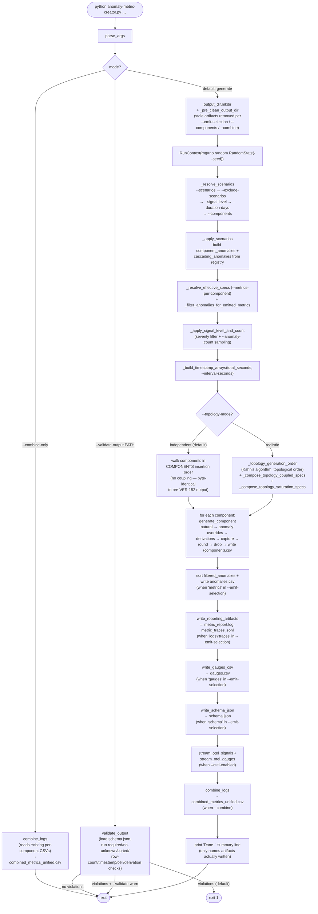

# Application flow

End-to-end execution of `main(argv=None)` in `anomaly-metric-creator.py`.
The script has three top-level modes — `--combine-only` (rebuild the
unified CSV from existing per-component CSVs), `--validate-output PATH`
(load `PATH/schema.json` and run every validator against the artifacts
on disk), and the default generation pipeline.

## Notes

- `--emit-selection` gates the four downstream writers
  (`anomalies.csv` is part of `metrics`; `metric_report.log` is
  `logs`; `metric_traces.jsonl` is `traces`; `gauges.csv` is `gauges`;
  `schema.json` is `schema`). Skipped writers are no-ops on this
  run, and `_pre_clean_output_dir` removes any matching artifact left
  over from a prior run.
- `--validate-output` is mutually exclusive with `--combine` /
  `--combine-only`; it short-circuits before any generation.
- Topology coupling and saturation (the right branch of the
  `--topology-mode` decision) re-shape downstream `MetricSpec`
  baselines from upstream load columns captured during generation.
  See [Topology graph (v1)](./topology.md) for the edge set and
  saturation parameters.
