# Application flow

End-to-end execution of `main(argv=None)` in `anomaly-metric-creator.py`.
The script has three top-level modes — `--combine-only` (rebuild the
unified CSV from existing per-component CSVs), `--validate-output PATH`
(load `PATH/schema.json` and run every validator against the artifacts
on disk), and the default generation pipeline.

```mermaid
flowchart TD
    start(["python anomaly-metric-creator.py …"]) --> parse["parse_args"]
    parse --> mode{"mode?"}

    mode -- "--combine-only" --> combineonly["combine_logs<br/>(reads existing per-component CSVs)<br/>→ combined_metrics_unified.csv<br/>(wide or long layout — auto-detected<br/>from per-component CSV headers)"]
    combineonly --> finish([exit])

    mode -- "--validate-output PATH" --> validate["validate_output<br/>(load schema.json,<br/>run required/no-unknown/sorted/<br/>row-count/timestamp/cell/derivation/<br/>long-form-dimensions/topology-coupling/<br/>per-instance-coupling checks)"]
    validate -- "no violations" --> finish
    validate -- "violations + --validate-warn" --> finish
    validate -- "violations (default)" --> failexit([exit 1])

    mode -- "default: generate" --> preclean["output_dir.mkdir<br/>+ _pre_clean_output_dir<br/>(stale artifacts removed per<br/>--emit-selection / --components / --combine)"]
    preclean --> ctx["RunContext(rng=np.random.RandomState(--seed))"]
    ctx --> instances{"instance map?"}
    instances -- "default (N=1, anonymous)" --> instdefault["ctx.instances =<br/>{name: [Instance()] for name in COMPONENTS}<br/>→ byte-identical legacy CSV (no dim prefix)"]
    instances -- "--instances-per-component N" --> instflag["ctx.instances =<br/>{name: [Instance(id=f'i{k}',<br/>pod=f'pod-{k}') for k in range(N)]<br/>for name in COMPONENTS}<br/>(N ∈ [1, MAX_INSTANCES_PER_COMPONENT=20])"]
    instances -- "--instance-config PATH" --> instconfig["_load_instance_config(PATH)<br/>(YAML or JSON; per-component override,<br/>missing entries fall back to INSTANCES default)"]
    instdefault --> resolve["_resolve_scenarios<br/>--scenarios → --exclude-scenarios<br/>→ --signal-level → --duration-days<br/>→ --components"]
    instflag --> resolve
    instconfig --> resolve
    resolve --> apply["_apply_scenarios<br/>build component_anomalies +<br/>cascading_anomalies from registry<br/>(scenarios may carry instance_filter)"]
    apply --> specs["_resolve_effective_specs (--metrics-per-component)<br/>+ _filter_anomalies_for_emitted_metrics"]
    specs --> cap["_apply_signal_level_and_count<br/>(severity filter + --anomaly-count sampling)"]
    cap --> ts["_build_timestamp_arrays(total_seconds,<br/>--interval-seconds)"]

    ts --> torder{"--topology-mode?"}
    torder -- "realistic (default)" --> realorder["_topology_generation_order<br/>(Kahn's algorithm, topological order)"]
    torder -- "independent (deprecation alias)" --> indorder["walk components in<br/>COMPONENTS insertion order<br/>(no coupling, no saturation,<br/>no int-cast — byte-identical<br/>to pre-flag-day output;<br/>emits DeprecationWarning)"]

    realorder --> dispatch{"per-component<br/>instance list?"}
    dispatch -- "single anonymous Instance()" --> shared["_compose_topology_coupled_specs<br/>+ _compose_topology_saturation_specs<br/>(shared lambda-baked path;<br/>byte-identical to legacy realistic mode)"]
    dispatch -- "N > 1 OR any dimensioned" --> perinst["_compute_topology_arrays_per_instance<br/>(1:1 matched cardinalities OR<br/>uniform fan-out averaging;<br/>shared RNG noise across instances)"]

    shared --> gen["for each component: generate_component<br/>natural → anomaly overrides (per-instance under<br/>instance_filter) → dtype='int' rounded via np.rint<br/>(realistic mode only) → derivations →<br/>capture (shared + per-instance) →<br/>round → drop → write {component}.csv<br/>(wide CSV if anonymous, long CSV with<br/>id/host/pod/az/region/tenant prefix otherwise)"]
    perinst --> gen
    indorder --> gen

    gen --> anomcsv["sort filtered_anomalies +<br/>write anomalies.csv<br/>(when 'metrics' in --emit-selection)"]
    anomcsv --> reports["write_reporting_artifacts<br/>→ metric_report.log, metric_traces.jsonl<br/>(when 'logs'/'traces' in --emit-selection)"]
    reports --> gauges["write_gauges_csv<br/>→ gauges.csv<br/>(4-col wide OR 10-col long layout,<br/>auto-detected from per-component CSV headers;<br/>when 'gauges' in --emit-selection)"]
    gauges --> schema["write_schema_json<br/>→ schema.json (v2)<br/>metadata + components (with optional<br/>per-component dimensions block) +<br/>files + topology snapshot<br/>(when 'schema' in --emit-selection)"]
    schema --> otel["stream_otel_signals +<br/>stream_otel_gauges<br/>(non-empty dim cells surface as<br/>OTLP data point attributes;<br/>when --otel-enabled)"]
    otel --> combine["combine_logs<br/>→ combined_metrics_unified.csv<br/>(wide OR long layout — same auto-detect<br/>as gauges.csv; when --combine)"]
    combine --> summary["print 'Done -' summary line<br/>(only names artifacts actually written)"]
    summary --> finish
```

## Notes

- `--emit-selection` gates the four downstream writers
  (`anomalies.csv` is part of `metrics`; `metric_report.log` is
  `logs`; `metric_traces.jsonl` is `traces`; `gauges.csv` is `gauges`;
  `schema.json` is `schema`). Skipped writers are no-ops on this
  run, and `_pre_clean_output_dir` removes any matching artifact left
  over from a prior run.
- `--validate-output` is mutually exclusive with `--combine` /
  `--combine-only`; it short-circuits before any generation. The
  validator dispatches per-component cell, derivation, and row-count
  checks against the wide or long CSV layout based on the schema's
  per-component `dimensions` block.
- Topology coupling and saturation (the right branch of the
  `--topology-mode` decision) re-shape downstream `MetricSpec`
  baselines from upstream load columns captured during generation.
  Under `--instances-per-component N>1` (or any dimensioned
  `--instance-config`), the per-instance dispatch routes each
  downstream pod through its matching upstream pod (1:1) or a
  uniform fan-out average. See [Topology graph (v1)](./topology.md)
  for the edge set, saturation parameters, and per-instance routing
  dispatch.
- Two flags populate `ctx.instances` and are mutually exclusive at
  parse time: `--instances-per-component N` (uniform fan-out across
  every component, `pod=pod-0..pod-N-1`) and `--instance-config PATH`
  (YAML/JSON per-component override map; components not listed fall
  back to the anonymous default). The single anonymous `Instance()`
  default keeps every per-component CSV on the legacy
  `timestamp,m0,m1,…` shape; any named or fanned-out instance
  switches that component's CSV to the long form
  `timestamp,id,host,pod,az,region,tenant,m0,m1,…`. The same
  dispatch propagates into `gauges.csv` (10-column long layout) and
  `combined_metrics_unified.csv` (the long writer dispatches when
  *any* per-component CSV is dimensioned).

## Significant changes

Recent significant additions reflected in the diagram above:

- **Multi-instance fan-out** (`Instance` dataclass, Phases 1–6) —
  `ctx.instances` map seeded from one of three paths (default
  anonymous, `--instances-per-component N`, or `--instance-config
  PATH`) and threaded through `generate_component(..., instances=...)`.
  Long-form per-component CSVs carry an
  `id,host,pod,az,region,tenant` prefix; `gauges.csv` and
  `combined_metrics_unified.csv` both auto-detect and switch between
  the 4-column wide and 10-column long layouts; OTLP gauge and
  signal datapoints surface non-empty dim cells as attributes.
- **Per-instance topology dispatch** (Phase 8) —
  `_compute_topology_arrays_per_instance` replaces the shared
  lambda-baked composer whenever the per-component instance list is
  named or fanned out. Matched upstream/downstream cardinalities
  use 1:1 routing (each downstream pod consumes its matching
  upstream pod's captured load); mismatched cardinalities fall back
  to uniform fan-out averaging across upstream pods. RNG noise is
  drawn once per coupled metric and shared across instances so
  symmetric upstream produces byte-identical output to the N=1
  path.
- **Schema document v2 with topology snapshot** (Phase 7) —
  `write_schema_json` now serializes the active `TOPOLOGY` graph
  alongside metadata, per-component metric metadata, and the
  emitted-files list. Phase 8 adds an optional per-component
  `dimensions: {axes, cardinality}` block when the component's
  instance list is dimensioned (omitted in the anonymous default to
  keep v1 schema bytes byte-identical).
- **Validator additions** —
  `_validate_topology_coupling` (Phase 7) enforces per-edge Pearson
  correlation between source and target canonical load metrics,
  with anomaly windows excluded.
  `_validate_topology_coupling_per_instance` (Phase 8) runs the
  same check pod-by-pod under matched cardinalities.
  `_validate_long_form_dimensions` checks the long-form
  `gauges.csv` and `combined_metrics_unified.csv` headers.
  `_validate_component_row_count` and `_validate_component_cells`
  are dim-aware: row-count bands scale by `cardinality`, and
  cell-range / derivation checks offset the metric-column index
  past the dim prefix.
- **`instance_filter` on anomaly specs** (Phase 4) — primary and
  cascade specs in `SCENARIOS` may carry an `instance_filter`
  (iterable of `Instance.id`s or callable predicate) that restricts
  the override to a subset of pods. Zero-match emits a stderr
  WARNING and skips the spec; non-zero-match produces exactly one
  manifest entry regardless of pod count. First consumed by the
  `auth_pod_failure` and `cache_az_isolation` partial-outage
  scenarios.
- **Flag-day default flip + integer-cast bundle** (Phase 6) —
  `--topology-mode realistic` is the default; `--topology-mode
  independent` is a deprecation alias that emits a stderr
  `DeprecationWarning` and skips both topology composition and the
  `dtype="int"` `np.rint` cast (so its CSV bytes stay byte-for-byte
  identical to the pre-flag-day baseline pinned by
  `LEGACY_INDEPENDENT_ONE_DAY_HASHES`). All other locked SHA-256
  hashes in `tests/` were re-baselined under realistic mode in that
  PR.
