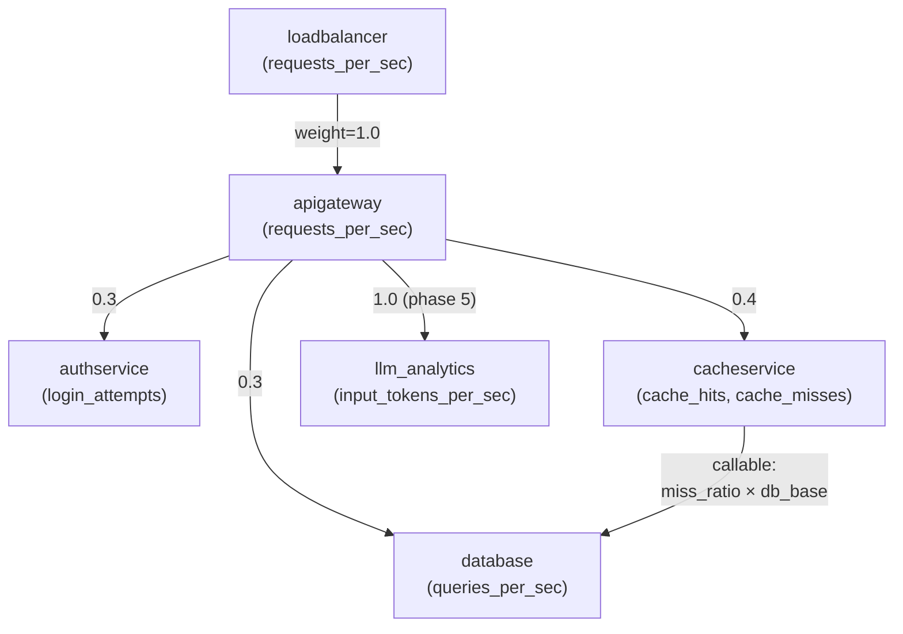

# Topology graph (v1)

The `TOPOLOGY` constant in `anomaly-metric-creator.py` declares the directed
service-call graph alongside `COMPONENTS`. It is consulted by
`--topology-mode realistic` — the default since VER-156 phase 6 flag day
— to thread upstream load through downstream baselines and to lift
downstream latency / error columns via per-edge `SaturationParams`.
`--topology-mode independent` is retained as a deprecation alias that
skips the graph entirely (no coupling, no saturation) so the
pre-flag-day baseline can be regenerated for byte-for-byte diffing;
the alias emits a stderr `DeprecationWarning` on use and is scheduled
for removal after VER-141 phase 9.

The full prose description of each edge — fan-out share semantics,
single-incoming-edge renormalization, callable weights, and per-edge
saturation tuning — lives in the **Topology graph (v1)** section of the
[main README](../README.md#topology-graph-v1). The diagram below renders
that edge set graphically.

Edge labels are constant fan-out weights unless otherwise noted; the
`auth` / `cache` / `database` routing trio shares the `0.3 / 0.4 / 0.3`
request-share fractions, while the `apigateway → llm_analytics` weight
is independent (single-incoming-edge renormalization). The
`cacheservice → database` callable contribution is additive on top of
the `apigateway → database` constant contribution. Every constant-weight
edge except `cacheservice → database` also carries `SaturationParams`
(see the [per-edge bullet list](../README.md#topology-graph-v1) in the
README for midpoint / steepness / latency-gain / error-gain values).
