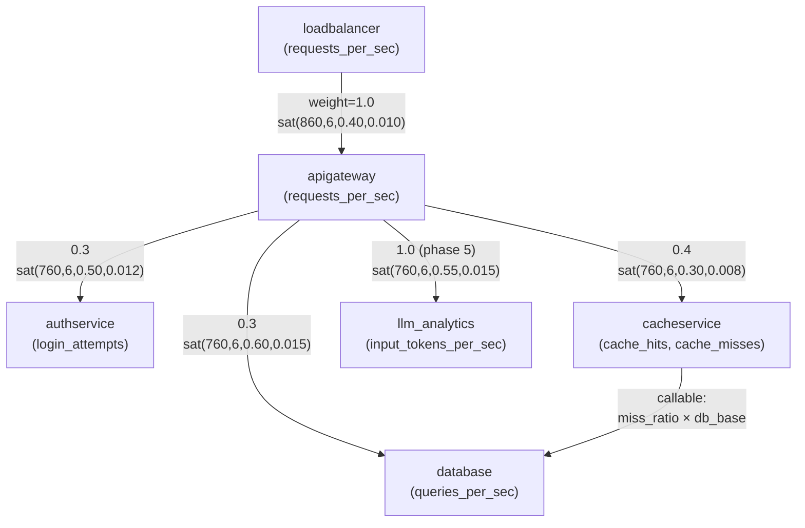
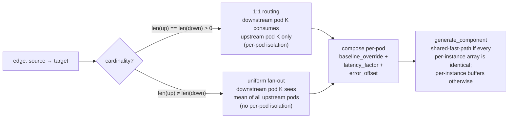

# Topology graph (v1)

The `TOPOLOGY` constant in `anomaly-metric-creator.py` declares the directed
service-call graph alongside `COMPONENTS`. It is consulted by
`--topology-mode realistic` — the default since phase 6 flag day
— to thread upstream load through downstream baselines and to lift
downstream latency / error columns via per-edge `SaturationParams`.
`--topology-mode independent` is retained as a deprecation alias that
skips the graph entirely (no coupling, no saturation) so the
pre-flag-day baseline can be regenerated for byte-for-byte diffing;
the alias emits a stderr `DeprecationWarning` on use and is scheduled
for removal after phase 9.

The full prose description of each edge — fan-out share semantics,
single-incoming-edge renormalization, callable weights, and per-edge
saturation tuning — lives in the **Topology graph (v1)** section of the
[main README](../README.md#topology-graph-v1). The diagram below renders
that edge set graphically.

Edge labels carry the constant fan-out weight (or `callable:` marker)
on the first line and the `SaturationParams(midpoint, steepness,
latency_gain, error_gain)` tuple on the second line where one is
declared. The `auth` / `cache` / `database` routing trio shares the
`0.3 / 0.4 / 0.3` request-share fractions, while the
`apigateway → llm_analytics` weight is independent (single-incoming-edge
renormalization). The `cacheservice → database` callable contribution
is additive on top of the `apigateway → database` constant contribution
and carries no saturation in v1. See the
[per-edge bullet list](../README.md#topology-graph-v1) in the README
for the parameter rationale and bounds.

## Per-instance routing dispatch (phase 8)

Under `--topology-mode realistic` (default) with multi-instance
fan-out — `--instances-per-component N>1` or a non-default
`--instance-config` that declares named instances — the per-instance
topology dispatch in `_compute_topology_arrays_per_instance` reshapes
each downstream pod's view of its upstream:

The matched-cardinality branch is what
`tests/test_topology_multi_instance.py` pins: a slow upstream pod
produces saturation feedback only on the corresponding downstream
pod's rows, sibling pods stay on the natural baseline. The validator's
`_validate_topology_coupling_per_instance` enforces the same
invariant after the fact by computing Pearson per matched pod pair.

The single anonymous `Instance()` default keeps the shared
lambda-baked path (`_compose_topology_coupled_specs` +
`_compose_topology_saturation_specs`) for byte-identical legacy
output, so the per-instance routing diagram applies only when the
per-component instance list is named or fanned out.

## Significant changes

Recent significant additions reflected in the diagrams above:

- **Per-instance routing dispatch** (Phase 8) — under
  `--instances-per-component N>1` (or any dimensioned
  `--instance-config`), each edge routes 1:1 by pod index when
  upstream and downstream cardinalities match, and falls back to
  uniform fan-out averaging when they differ. RNG noise is drawn
  once per coupled metric and shared across pods so symmetric
  upstream produces byte-identical output to the shared
  lambda-baked path used in the N=1 default.
- **LLM token-throttle edge** (Phase 5) — promoted the
  `apigateway → llm_analytics` placeholder into a real coupling +
  saturation edge. Couples `llm_analytics.input_tokens_per_sec`
  to apigateway RPS and lifts `avg_llm_latency_ms`,
  `p95_llm_latency_ms`, and `llm_api_error_rate` as apigateway
  saturates the token budget. Apigateway is the metering authority
  (no synthetic `token_limiter` virtual node).
- **Saturation feedback on every front-half edge** (Phase 4) —
  `SaturationParams(midpoint, steepness, latency_gain, error_gain)`
  on the four constant-weight front-half edges
  (`loadbalancer→apigateway`, `apigateway→{auth,cache,db}`) and
  the LLM edge. Midpoints sit at ~80% of upstream natural peak
  load; `latency_gain` scales with downstream sensitivity
  (database 0.6 > authservice 0.5 > apigateway 0.4 > cacheservice
  0.3); `error_gain` ∈ [0.005, 0.02] so the saturation offset
  alone can never push `error_rate` above 1.0.
- **Realistic-mode coupling on every front-half edge** (Phases 2/3)
  — `_compose_topology_coupled_specs` rewrites downstream
  `MetricSpec` baselines from captured upstream load.
  Constant-weight edges normalize their share so the combined
  contribution equals `downstream_base` at natural upstream load;
  callable-weight edges (today only `cacheservice → database`)
  derive a per-row signal from upstream columns via `Edge.signal`
  and produce an additive contribution.
- **Schema topology snapshot** (Phase 7) — `schema.json` now
  carries a `topology` block (the active `TOPOLOGY` graph
  serialized via `_serialize_topology`, restricted to active
  components, edge lists sorted by target). Consumed by
  `_validate_topology_coupling` and (Phase 8)
  `_validate_topology_coupling_per_instance` so a regression that
  decouples or mis-routes an edge surfaces as a dedicated
  Pearson-correlation violation at validation time.
- **Phase 9 catalog re-tune** — eleven hand-tuned cascade and
  primary generator values that previously sat at or below the
  realistic-mode saturation noise floor were lifted by >3σ.
  `tests/test_scenario_deviation.py` is the regression guard:
  every recorded `anomalies.csv` row must deviate >1σ from a
  scenario-excluded baseline.
